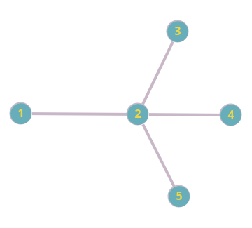
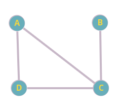
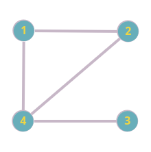
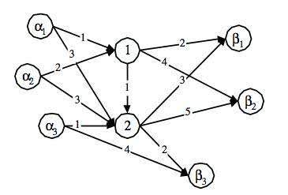

<!-----

Conversion time: 1.845 seconds.

Using this Markdown file:

1. Paste this output into your source file.
2. See the notes and action items below regarding this conversion run.
3. Check the rendered output (headings, lists, code blocks, tables) for proper
   formatting and use a linkchecker before you publish this page.

Conversion notes:

* Docs to Markdown version 1.0$\beta$35
* Mon Dec 18 2023 05:04:11 GMT-0800 (PST)
* Source doc: trabalho_final_respostas
* Tables are currently converted to HTML tables.
----->

Universidade Federal do Pará 

Instituto de Ciências Exatas e Naturais

Faculdade de Computação

Análise de Algoritmos

3ª Avaliação

Alunos:

* Luiz Antônio Lima de Freitas Leite - matrícula: 202204940008
* Max José Lobato Pantoja Júnior - matrícula: 202204940031
* Luiz Sérgio Samico Maciel Filho - matrícula: 202204940042
* Wesley Pontes Barbosa - matrícula: 202204940006 

# Questão 1.

## Analise as afirmativas abaixo considerando que $\pi_1$ e $\pi_2$ são problemas de decisão e que $\pi_1$ é uma restrição de $\pi_2$. Em seguida, responda se cada uma das afirmativas é verdadeira ou falsa e justifique sua resposta.

### I. Se $\pi_1 \in$ P então $\pi_2 \in$ P.

> RESPOSTA: VERDADEIRO,
por que $\pi_1$ sendo uma restrição de $\pi_2$ ($\pi_2$ $\propto$ $\pi_1$) implica que a instância de $\pi_1$ é um caso específico de $\pi_2$ com algumas condições adicionais. Se já é possível resolver $\pi_1$ em tempo polinomial, então também será possível resolver $\pi_2$ em tempo polinomial, pois $\pi_2$ engloba $\pi_1$ e, portanto, incluirá a solução para $\pi_1$.

### II. Se $\pi_2 \in$ NP e $\pi_1 \in$ NP-Completo, então $\pi_2 \in$ NP-Completo.
> RESPOSTA: VERDADEIRO, pois para $\pi_2$ ser NP-Completo deve satisfazer 2 condições:<br>
> Condição 1: $\pi_2 \in$ NP.<br>
> Condição 2: Todo problema $\beta \in$ NP satisfaz $\beta \propto \pi_2$.
>
>A primeira condição já foi dada, e a segunda condição é satisfeita por transitividade: Sabemos que $\pi_1 \propto \pi_2$, pois $\pi_1$ é restrição de $\pi_2$, então:
>
>$\beta \propto \pi_1$ e $\pi_1 \propto \pi_2  \Rightarrow \beta \propto \pi_2$
>
>Em resumo: “Sejam $\pi_1$ e $\pi_2$ problemas em NP. Se $\pi_1$ for NP-Completo e $\pi_1 \propto \pi_2$, então $\pi_2$ também é NP-Completo.”


### III. $\pi_1$ e $\pi_2$ são polinomialmente equivalentes.

> RESPOSTA: FALSO, <br>
pois apenas está definido que ambos os problemas são de decisão e $\pi_1$ $\propto$ $\pi_2$ , e para serem polinomialmente equivalentes é necessário que $\pi_2$ $\propto$ $\pi_1$ também, o que não pode ser afirmado sem informações adicionais.


### IV. Por serem problemas de decisão, é certo que $\pi_1$ e $\pi_2$ não pertencem à classe NP-Difícil.

> RESPOSTA: FALSO,<br>
pois a classe de problemas NP-Completo, por exemplo, é composta por problemas de decisão NP que ao mesmo tempo são NP-Difícil, portanto, se $\pi_1$ e $\pi_2$ são NP-Completo eles são obrigatoriamente NP-Difícil.

# Questão 2.

## Analise as afirmativas abaixo considerando o problema de decisão da satisfatibilidade de fórmulas (SAT). Em seguida, responda se cada uma das afirmativas é verdadeira ou falsa e justifique sua resposta.

### I. Se SAT está em P, então P $=$ NP.

> RESPOSTA: VERDADEIRO,<br>
pois SAT é NP-Completo e satisfaz a propriedade de que todo problema $\beta \in$ NP satisfaz $\beta \propto$ SAT. Então se SAT for resolvido em tempo polinomial, por transitividade, todos os problemas em NP poderão ser resolvidos em tempo polinomial também após serem transformados em SAT também em tempo polinomial.

### II. Se um problema de decisão $\pi$ está em NP, então SAT é polinomialmente transformável em $\pi$.

>RESPOSTA: FALSO,<br>
pois mesmo que todo problema $\beta \in$ NP satisfaz $\beta \propto$ SAT, o vice-versa não é garantido, portanto é incorreto afirmar SAT $\propto$ $\beta$.

### III. Um problema $\pi$ está em NP-Difícil se e somente se SAT é polinomialmente transformável em $\pi$.

> RESPOSTA: VERDADEIRO,<br>
pois para um problema $\pi$ estar em NP-Difícil ele deve satisfazer a propriedade de que todo problema $\beta \in$ NP satisfaz $\beta \propto \pi$, e como SAT é NP-Completo, e por consequência também é NP, isso implica que SAT $\propto \pi$ deve ser verdadeiro para que $\pi$ satisfaça essa propriedade dos NP-Difíceis.

### IV. Uma importante consequência do Teorema de Cook é que se existe um algoritmo de tempo polinomial para resolver SAT, então existe um algoritmo de tempo polinomial para resolver todos os problemas em NP.

> RESPOSTA: VERDADEIRO,<br>
pois SAT é NP-Completo e satisfaz a propriedade de que todo problema $\beta \in$ NP satisfaz $\beta \propto$ SAT. Então se SAT for resolvido em tempo polinomial, por transitividade, todos os problemas em NP poderão ser resolvidos em tempo polinomial também após serem transformados em SAT também em tempo polinomial.

# Questão 3. 

## Dado que $\pi_1$ e $\pi_2$ são problemas de decisão, indique se cada uma das afirmativas abaixo é verdadeira ou falsa. Em seguida, justifique sua resposta.

### I. Se $\pi_1 \in$ NP-Completo e $\pi_2 \in$ NP, então $\pi_1 \propto \pi_2$

>RESPOSTA: FALSO,<br>
pois mesmo que todo problema $\pi_2 \in$ NP satisfaz $\pi_2 \propto \pi_1$, o vice-versa não é garantido, portanto é incorreto afirmar $\pi_1 \propto \pi_2$.

### II. Não é possível ter uma heurística de custo polinomial para um problema NP-Completo que, para qualquer dado de entrada, garanta obter a solução ótima do problema.

>RESPOSTA: VERDADEIRO,<br>
pois, se fosse encontrado um algoritmo de tempo polinomial que resolva um problema NP-Completo para todas as entradas, isso equivaleria a mostrar que P (problemas solúveis em tempo polinomial) é igual a NP (problemas cujas soluções podem ser verificadas em tempo polinomial), mas até agora essa questão permanece um problema em aberto na teoria da complexidade computacional. Até que essa questão seja resolvida, acredita-se que não existem heurísticas polinomiais que garantam soluções ótimas para todos os casos de problemas NP-Completo.

### III. Considere que $\pi_1 \in$ NP-Completo. Caso fosse descoberto um algoritmo polinomial para resolver $\pi_1$, então todos os problemas em NP também poderiam ser resolvidos em tempo polinomial.

>RESPOSTA: VERDADEIRO,<br>
pois sendo $\pi_1$ NP-Completo ele satisfaz a propriedade de que todo problema $\beta \in$ NP satisfaz $\beta \propto \pi_1$. Então se $\pi_1$ for resolvido em tempo polinomial, por transitividade, todos os problemas em NP poderão ser resolvidos em tempo polinomial também após serem transformados em $\pi_1$ também em tempo polinomial.

### IV. Se P $=$ NP, então todo problema NP-Difícil pode ser resolvido em tempo polinomial.

>RESPOSTA: FALSO,<br>
pois, por exemplo:
>
>É verdade que se $\pi_1$ é restrição de $\pi_2$ , ou seja,  $\pi_2 \propto \pi_1$, e $\pi_1$ é resolvido em tempo polinomial, então $\pi_2$ também é resolvido. Entretanto, o vice-versa não é garantido.
>
>Portanto ainda que para todo problema $\beta \in$ P $=$ NP e $\pi \in$ NP-Difícil, é verdade que $\beta \propto \pi$, resolver $\beta$ não garante a resolução de $\pi$.


### V. Suponha que $\pi_1$ e $\pi_2$ pertencem à classe NP-Completo. Isso implica que existe uma transformação polinomial no tempo de um problema para outro mesmo se P $\neq$ NP.

>RESPOSTA: VERDADEIRO,<br>
pois atualmente não se sabe se P $\neq$ NP, mas já é possível observar que os problemas NP-Completo são polinomialmente equivalentes entre si.

# Questão 4. 

## Uma cobertura de vértices de um grafo $G \neq (V, E)$ é um subconjunto $V^{\prime} \subseteq V$ de $k$ vértices, tal que se $(u, w) \in E$ então $u \in V^{\prime}$ ou $w \in V^{\prime}$ . Isto posto, considere o problema de decisão $\pi$ descrito abaixo para responder os itens a seguir.

### Dados de entrada: Um grafo $G$ e um inteiro $k > 0$.
### Decisão: $G$ possui uma cobertura de vértices de tamanho $\leq k$?
### a) Mostre se o problema $\pi$ pertence, ou não, à classe NP.

>RESPOSTA:  
Para provar que $\pi$ pertence a NP é necessário verificá-lo:<br>
FASE 1: Exibição e justificativa da resposta “sim”.<br>
Dado o grafo $G$ e $k \leq$ 2:<br>



>$G(V, E);$ <br>
>$V = \{1, 2, 3, 4, 5\};$ <br>
>$E = \{(1, 2), (2, 3), (2, 4), (2, 5)\}$
>
>Justificativa para a cobertura de vértices de tamanho menor que 2: <br>
$V^{\prime} = \{2\}$
>
>FASE 2: verificação da resposta “sim” em tempo polinomial:<br>
>
>pseudocódigo:
```
VERIFICA(G,V',k)
    // primeiro testa o tamanho de V'
    se |V'| > k:
        retorna "FALSO"
    // depois verifica se V' cobre todas as arestas
    teste = E // conjunto teste temporário
    para cada v em V':
        para cada e em teste: // "e" é aresta
            se v está em e:
                remove e de teste
    se |teste| == 0: retorna "VERDADEIRO"
    senão: retorna "FALSO"
```

>complexidade de tempo: \
$O(\mid V^{\prime}\mid + \mid V^{\prime} \mid \ast E)$ <br>
termo mais dominante \
$ O( \mid V^{\prime} \mid \ast E) $ \
como V não pode ser maior que K: \
$ O(k \ast E) $

### b) Sabe-se que o problema da satisfatibilidade de fórmulas (SAT) é polinomialmente transformável no problema $\pi$. Então, é possível afirmar que $\pi \in$ NP-Completo? Por quê?

>RESPOSTA: Sim,<br>
pois para ser NP-Completo deve satisfazer 2 condições:<br>
Condição 1: $ \pi \in $ NP.<br>
Condição 2: Todo problema $\beta \in $ NP satisfaz $\beta$ $\propto$ $\pi$.
>
>A primeira condição já foi dada, e a segunda condição é satisfeita por transitividade:
>
>$\beta \propto$ SAT e SAT $\propto \pi \Rightarrow \beta \propto \pi$
>
>Em resumo: “Sejam $\pi_1$ e $\pi_2$ problemas em NP. Se $\pi_1$ for NP-Completo e
>
>$\pi_1 \propto \pi_2$ , então $\pi_2$ também é NP-Completo.”

## Questão 5. Considere o problema de decisão $\pi$ descrito abaixo.

### $\bullet$ Dados de entrada: Dois grafos $G_1 = (V_1, E_1)$ e $G_2 = (V_2, E_2)$, com $|V_1| = |V_2|$.

### $\bullet$ Decisão: Existe uma função $ f : V_1 \rightarrow V_2$, tal que $(u, w) \in E_1$ se e somente se $(f(u), f(w)) \in E_2$, para todo $u, w \in V_1$?

### Mostre se o problema $\pi$ pertence, ou não, à classe NP.

>RESPOSTA:
Para provar que $\pi$ pertence a NP é necessário verificá-lo:
>
>FASE 1: Exibição e justificativa da resposta “sim”.

Dado o grafo $G_1$: \


e $G_2$: \


>justificativa para função que transforma G1 em G2: \
$f: {A \rightarrow 2; D \rightarrow 1; C \rightarrow 4; B \rightarrow 3;}$
>
>FASE 2: verificação da resposta “sim” em tempo polinomial:
>
>pseudocódigo:
```
VERIFICA(G1, G2, f())
    // primeiro testa as cardinalidades de V1 e V2
    se |V1| != |V2|:
        retorna "FALSO"
    teste1 = {} // conjunto de teste temporário
    teste2 = E2 // conjunto de teste temporário
    // depois aplica a função f() nos elementos de V1
    para cada (u, w) em E1:
        // adiciona a aresta com os vértices transformados por f()
        teste1 = teste1 + (f(u), f(w))
    // em seguida verifica se G1 tornou-se equivalente a G2
    para cada (u1, w1) em teste1:
        para cada (u2, w2) em teste2:
            se (u1, w1) == (u2, w2):
                remove (u1, w1) de teste1
                remove (u2, w2) de teste2
                pula para o próximo elemento de teste1
    se |teste1 + teste2| == 0: retorna "VERDADEIRO"
    senão: retorna "FALSO"
```
>complexidade de tempo: \
>$O(\mid V1 \mid + \mid E1 \mid + \mid E1 \mid \cdot \mid E2\mid )$ \
>termo mais dominante \
>$O(\mid E1 \mid \cdot \mid E2 \mid)$

# Questão 6. Essa questão é composta por 2 (dois) problemas. Observe que todos os algoritmos usados para resolver os problemas devem ser eficientes, ou seja, não é permitido o uso de algoritmos não-polinomiais em nenhuma parte da solução apresentada.

## Problema 1

A Segunda Guerra Mundial iniciou-se no dia 1 de setembro de 1939, quando a Polônia foi subitamente atacada pela Alemanha. O Estado-Maior polonês se reuniu de imediato para decidir sobre as movimentações de tropas que deveriam efetuar, de modo a fazer frente à invasão alemã.

As forças polonesas foram informadas que o ataque alemão se daria em três frentes distintas, com nomes de código $\beta$<sub>1</sub>, $\beta$<sub>2</sub> e $\beta$<sub>3</sub>. Chegou-se à conclusão que seria necessário transportar duas divisões de combate para $\beta$<sub>1</sub>, uma divisão para $\beta$<sub>2</sub> e uma outra para $\beta$<sub>3</sub>. A Polônia dispunha nessa altura de cinco divisões de combate nas cidades mais próximas da fronteira atacada, duas aquarteladas na cidade $\alpha$<sub>1</sub>, duas em $\alpha$ <sub>2</sub> e uma aquartelada em $\alpha$<sub>3</sub>. Essas divisões poderiam ser transportadas para os locais em perigo, contudo, a força aérea alemã já sobrevoava a Polônia, e a movimentação das divisões teria que ser feita com o menor risco humano possível.

Após uma rápida inspeção do mapa do território, fez-se o esquema da Figura 1, onde as estradas que poderiam ser utilizadas pelas divisões de combate polonesas são apresentadas. Observe que o valor da aresta representa a distância em quilômetros.



Figura 1: Esquemático do território.

Os generais poloneses precisavam decidir de que aquartelamento deviam seguir as divisões necessárias em $\beta$<sub>1</sub>, $\beta$<sub>2</sub> e $\beta$<sub>3</sub>. O objetivo era a minimização das perdas humanas, relacionado diretamente com o perigo de bombardeamento.

Então, durante a reunião decisiva, o general polonês Edward disse: “O perigo de bombardeamento das divisões em movimento pode ser considerado como diretamente proporcional à distância entre cada cidade $\alpha$ e cada frente $\beta$. Nesse caso, devem-se usar essas distâncias como o perigo que uma divisão corre ao ser transportada de $\alpha$<sub>i</sub> para $\beta$<sub>i</sub>”. Em seguida, o general Jerzy ordenou: “A divisão que sobrar fica no aquartelamento respectivo”.

### Tarefa: Siga as instruções dos generais Edward e Jerzy, e informe quais foram as decisões tomadas pelas forças armadas polonesas. Explique detalhadamente, por meio de um relatório técnico, a estratégia e os algoritmos usados para resolver o problema.

---
>RESPOSTA:
>Para solucionar a questão, inicialmente definimos o problema da seguinte maneira:
>
> No grafo $G=\{E,V\}$ de $v \in V$ vértices e $e \in E$ arestas com um custo $c(e)$, e sendo $b(v)$ a quantidade de recursos em $v$, temos que $v$ é uma fonte $s \in S$ se $b(v)>0$ e $v$ é um destino $t \in T$ se $b(v) < 0$ e um caminho de um nó s para um nó t é um conjunto de arestas $p \in P$ em que $p = {(s, i_1), (i_1, i_2), (i_2, i_3), \dots , (i_{k−1}, i_k), (i_k, t)}$. O objetivo é definir os caminhos p de menor custo para suprir as demandas de recursos.
>
>A primeira tentativa de solução foi através da utilização do algoritmo de Dijkstra para encontrar o caminho de menor custo entre todos os caminhos de $P$ executando-o a partir de um nó de folga artificial em S até um outro nó de folga artificial em T, e fixamos esse menor caminho suprindo o máximo de demanda da fonte até que ela seja completamente suprida ou a fonte se esgote, depois rodamos o algoritmo de Dijkstra novamente para recalcular os menores caminhos desconsiderando os vértices supridos ou esgotados. 
>
>Esse método direto e intuitivo é uma forma um pouco personalizada de outro que já existia e chama-se método do custo mínimo, de complexidade $O(\mid E \mid+\mid V \mid \log{\mid V \mid })$, o qual, na verdade, não tem garantia de sempre retornar a resposta ótima.
> Como exemplificado no problema abaixo:


> Neste caso, em que  S = {a1, a2, a3} , T = {b1, b2, b3}, b(a1) = 2, b(a2) = 2, b(a3) = 1, b(b1) = -2, b(b2) = -1 e b(b3) = -1, ao aplicar o método que fixa primeiro a rota de menor caminho será escolhido a1 para suprir completamente b1 ao custo de 3 duas vezes ao invés de escolher a2 ao custo de 4, a3 suprirá b3 e por fim sobrará apenas a2 para suprir b2 ao custo de 100. Portanto, nós percebemos que era necessário um algoritmo que verificasse mais possibilidades, de forma eficiente, antes de decidir qual s é melhor para suprir cada t considerando o custo total, e não apenas o local.
>
>Assim, reanalisamos o problema e após pesquisa sobre o assunto, chegamos a conclusão de que se trata, na verdade, de **um problema de fluxo de custo mínimo**, tal seja, dado uma rede em que cada aresta $(i, j)$ possua um fluxo $X_{ij}$ e um custo $c_{ij}$ por unidade de fluxo, o custo total do fluxo na aresta é dado por $c_{ij}X_{ij}$. Um modelo que busca o fluxo de custo mínimo procura uma fluxo viável que tem o menor custo de fluxos:
 $$
 \begin{align} 
\text{Minimizar} &\qquad \Sigma_{(i,j)\in E}C_{ij}X_{ij} \notag\\
\text{s.t} \notag\\
 &\qquad \Sigma_{k:(j,k) \in E}X_{jk} - \Sigma_{i:(i,j)\in E}X_{ij} = b_j, j \in V\\
 &\qquad X_{ij} \geq 0, \qquad (i,j) \in E 
 \end{align}$$

>Considerando ainda que queremos abastecer da melhor maneira possível os nós de destino, podemos definir o problema como um problema para encontrar o **fluxo máximo de custo mínimo**.
>
>Dentre os algoritmos pesquisados que solucionam esse tipo de problema, como *Successive Shortest Path*, *Primal-Dual*, e *Network Simplex*, escolhemos o último por conta da performance apresentada.
>
>O algoritmo do *Network Simplex* é a aplicação do método simplex para a modelagem do problema como um programa linear. A estrutura de rede do problema, contudo, faz com que a solução seja significativamente mais simples do que um programa linear genérico (FOURER, 2004).
>
>Definido o programa linear, em uma iteração, o método simplex encontrará uma solução básica $\overline{X}_B$ correspondendo às soluções encontradas para as variáveis básicas $X_{ij}$. É importante notar que $\overline{X}_B$ descreverá uma árvore geradora na rede.
>
>Para começar o método simplex, é preciso resolver o sistema linear $\pi B=c_B$. Extraindo apenas os coeficientes das variáveis básicas do programa linear teremos uma matriz $B$ onde cada **coluna** corresponderá a uma variável básica $X_{ij}$ associada a um $c_B$. Cada coluna de $B$ possuirá apenas dois valores não nulos, $+1$ na linha $i$ e $-1$ na linha $j$; Além disso, as colunas de $B$ correspondentes a uma variável básica de folga $s_i$ terão apenas uma variável não nula, $1$, na coluna $i$.
>
>Os valores correspondentes em $c_B$ são $c{ij}$ para um $X_{ij}$ básico, e $0$ para um $s_i$ básico.
>   
>Por conta disso, as equações em $\pi B=c_B$ se resumem a um sistema simples, da forma:
>
>$$
>\pi_{i} - \pi_{j} = X_{ij}, \forall(i,j) \text{ utilizado em } \overline{X}_B.
>$$
>
>Assim, resolver um dado $\pi$ é uma operação de simples substituição.
>
>Em seguida, é preciso computar os **custos reduzidos**. Aqui, novamente, a natureza simples das restrições facilita o cômputo. o vetor de coeficientes $e_{ij}$ para um $x_{ij}$ não básico possui apenas dois valores não nulos, um $+!$ no $i$ésimo componente, e um $-1$ no $j$ésimo componente; além disso, o vetor de coeficiente $a_i$ para um $s_i$ não básico possui apenas um valor não nulo, $+1$ como $i$ésimo componente, reduzindo a formula para calcular os custos reduzidos para:
>$$
>d_{ij}=c_{ij}-\pi_i+\pi_j
>$$
> Repetimos os passos até que todos os custos reduzidos sejam não negativos. Quando isso ocorrer, teremos chegado na solução ótima.
    
>RESOLUÇÃO:
>
>Por motivos de melhorar a notação do problema, substituimos o nome dos vertices para valores numericos da seguinte forma: <br>
$\alpha_1 = 1;\\
\alpha_2 = 2; \\
\alpha_3 = 3; \\
1 = 4; \\
2 = 5; \\
\beta_1 = 6; \\
\beta_2 = 7; \\
\beta_3 = 8;$
>
>No problema especifico proposto as variáveis são:
>
>$V = \{1, 2, 3, 4, 5, 6, 7, 8\};$
>
>$S = \{1, 2, 3\};$
>
>$T = \{6, 7, 8\};$
>
>$b_1 = 2; 
b_2 = 2; 
b_3 = 1; 
b_6 = -2; 
b_7 = -1; 
b_8 = -1;$
>
>$E = \{(1, 4), 
(4, 6), 
(4, 7), 
(4, 5), 
(1, 5), 
(2, 6), 
(2, 7), 
(2, 8), 
(2, 4), 
(2, 2), 
(3, 2), 
(3, 8)\}$;
>
>$C_{14} = 1; 
C_{46} = 2; 
C_{47} = 4; 
C_{45} = 1; 
C_{15} = 3; 
C_{56} = 3; 
C_{57} = 5; 
C_{58} = 2; 
C_{24} = 2; 
C_{25} = 3; 
C_{35} = 1; 
C_{38} = 4 $
>
>E o programa linear resultante é:
>
>$min( x_{14} + 2\cdot x_{46} + 4\cdot x_{47} + x_{45} + 3\cdot x_{15} + 3\cdot x_{56} + 5\cdot x_{57} + 2\cdot x_{58} + 2\cdot x_{24} + 3\cdot x_{25} + x_{35} + 4\cdot x_{38})$ <br>
$st.$ <br>
$ x_{14} + x_{15} \leq 2 \\
 x_{24} + x_{25} \leq 2 \\
 x_{35} + x_{38} \leq 1 \\
 x_{45} + x_{46} + x_{47} - x_{14} - x_{24} = 0 \\
 x_{56} + x_{57} + x_{58} - x_{15} - x_{25} - x_{35} - x_{45} = 0 \\
 -x_{46} - x_{56} = -2 \\
 -x_{47} - x_{57} = -1 \\
 -x_{58} - x_{38} = -1 \\ $ 
>
>Escrito na forma canônica: 
>
>$min(  x_{14} + 2\cdot x_{46} + 4\cdot x_{47} + x_{45} + 3\cdot x_{15} + 3\cdot x_{56} + 5\cdot x_{57} + 2\cdot x_{58} + 2\cdot x_{24} + 3\cdot x_{25} + x_{35} + 4\cdot x_{38} )$ <br>
$st.$ <br>
$ x_{14} + x_{15} + S_1 = 2 \\
 x_{24} + x_{25} + S_2 = 2 \\
 x_{35} + x_{38} + S_3 = 1 \\
 x_{45} + x_{46} + x_{47} - x_{14} - x_{24} = 0 \\
 x_{56} + x_{57} + x_{58} - x_{15} - x_{25} - x_{35} - x_{45} = 0 \\
 -x_{46} - x_{56} = -2 \\
 -x_{47} - x_{57} = -1 \\
 -x_{58} - x_{38} = -1 $ 
>
>Acima, três variáveis de folga foram acrescentadas nas fontes, para descobrir qual o destacamento excedente que deve ficar na sua cidade respectiva.
>
>Após isso, devemos achar a primeira Solução Básica Viável:
>
>Passo 1: Determinar a variável básica que entra na base. Escolhemos $x_{32}$, pois tem o menor custo reduzido.

Passo 2:

>A variável $x_{32}$ entra na base, substituindo $z$.
Realizamos operações elementares para garantir que a coluna de $x_{32}$ na base seja uma matriz identidade.

Passo 3:

>Agora, determinamos a variável básica que sai da base. Para isso, calculamos as razões entre os termos na coluna rhs e a coluna de $x_{32}$. A menor razão indica a variável que sai.
Neste caso, $S_3$ sai da base.

Passo 4:

>A variável $S_3$ sai da base, e $x_{32}$ entra na base.
Atualizamos a tabela de acordo com a regra do pivô e repetimos os passos.
>
>Continuamos esses passos até alcançar a solução ótima. O processo envolve iterativamente escolher uma variável básica para entrar e uma para sair da base, atualizando a tabela a cada iteração, até que os custos reduzidos sejam todos não-negativos e a solução seja otimizada.
>
Solução final: 
>$z = 15; \\
x_{14} = 2; \\
x_{46} = 2; \\
x_{47} = 1; \\
x_{45} = 0; \\
x_{15} = 0; \\
x_{56} = 0; \\
x_{57} = 0; \\
x_{58} = 1; \\
x_{24} = 1; \\
x_{25} = 0; \\
x_{35} = 1; \\
x_{38} = 0; \\
S_1 = 0; \\
S_2 = 1; \\
S_3 = 0; \\$
>
>$b_1, 
b_2, 
b_3, 
b_6, 
b_7, 
b_8 = 0;$
>
> A partir dessa solução obtida no fim das iterações, podemos ver que os caminhos $p$ obtidos para cada batalhão foram: \
> $p_1 = \{(1, 4), (4, 6)\};$ para 2 batalhões \
> $p_2 = \{(2, 4), (4, 7)\};$ para 1 batalhão, e o outro aguarda na cidade (interpretando o resultado $S_2 = 1$) \
> $p_3 = \{(3, 5), (5, 8)\};$ para 1 batalhão 
> 
> Por fim, a complexidade de tempo do algoritmo Network Simplex depende de vários fatores, incluindo o número de variáveis e o número de restrições no problema de programação linear associado. Vamos analisar a complexidade de tempo em termos desses parâmetros.
>
>O algoritmo Network Simplex é geralmente mais eficiente do que o Simplex clássico para problemas de fluxo de rede devido à sua exploração da estrutura específica desses problemas. No entanto, a análise de complexidade de tempo pode ser complexa e depende do comportamento do algoritmo em casos específicos.
>
>Em termos gerais, para um problema de programação linear com nn variáveis e mm restrições, a complexidade de tempo do algoritmo Network Simplex é frequentemente expressa como O(n2⋅m)O(n2⋅m). No entanto, vale ressaltar que isso é uma simplificação e a complexidade real pode variar dependendo da implementação específica e das características do problema.
>
>A eficiência do Network Simplex se destaca em problemas de fluxo de rede, onde a estrutura da matriz de restrições é esparsa, ou seja, a maioria dos elementos é zero. Isso ocorre porque o algoritmo explora eficientemente a estrutura da rede durante suas iterações.
>
>Para problemas de fluxo de rede maiores e mais densos, outras variantes ou métodos mais recentes podem ser considerados para otimizar o desempenho.

### Referências do problema 1
1. Fourer, Robert. Solving Network Problems. Nortwester University, Illinois, Estados Unidos. 2004. Disponível em: http://www.4er.org/CourseNotes/Book%20B/B-IV.pdf.

2. ORLIN, James B. A polynomial time primal network simplex algorithm for minimum cost flows. Mathematical Programming, v. 78, p. 109-129, 1997.

2. Links diversos:<br>
3.1 https://ocw.mit.edu/courses/15-082j-network-optimization-fall-2010/resources/mit15_082jf10_lec16/

    3.2 https://codeforces.com/blog/entry/94190

    3.3 https://cp-algorithms.com/graph/min_cost_flow.html#complexity

    3.4 https://web.stanford.edu/class/cs361b/files/cs361b-notes.pdf

    3.5 https://www.youtube.com/watch?v=Sv3fb2xRhFI

    3.6 https://or.stackexchange.com/questions/5609/adding-slack-nodes-to-min-cost-network-flows
    
## Problema 2

Uma indústria deve fabricar um lote composto por 3 (três) peças: duas em PVC (peças A e B) e uma em aço inoxidável (peça C). As peças A e B devem ser torneadas e depois rosqueadas, mas a peça C deve apenas ser torneada. Depois de trabalhadas, as peças A e C devem ser montadas e então acopladas à peça B. Finalmente, as peças prontas devem ser embaladas e armazenadas.

Algumas dessas tarefas podem ser feitas simultaneamente, mas outras dependem de tarefas anteriores. Uma forma de codificar isso é por meio de uma tabela de precedências (vide Tabela 1). Note que ao lado de cada tarefa encontram-se as tarefas das quais ela depende imediatamente e a duração da tarefa em minutos.

Tabela 1: Tabela de Precedências.

<table>
  <tr>
   <td colspan$\neq$"3" >
    Tarefa (ou atividade)
   </td>
   <td>
    Antecedentes
   </td>
   <td>
    Duração (min)
   </td>
  </tr>
  <tr>
   <td>
   </td>
   <td colspan$\neq$"2" >
   </td>
   <td>
   </td>
   <td>
   </td>
  </tr>
  <tr>
   <td colspan$\neq$"2" >
    1. Preparar os tornos    
   </td>
   <td>–
   </td>
   <td>8
   </td>
  </tr>
  <tr>
   <td>
   </td>
   <td colspan$\neq$"2" >
   </td>
   <td>
   </td>
   <td>
   </td>
  </tr>
  <tr>
    <td colspan$\neq$"2" >
     2. Preparar as embalagens    
   </td>
   <td>–
   </td>
   <td>8
   </td>
  </tr>
  <tr>
   <td>
   </td>
   <td colspan$\neq$"2" >
   </td>
   <td>
   </td>
   <td>
   </td>
  </tr>
  <tr>
   <td colspan$\neq$"2" >
    3. Cortar e distribuir o PVC    
   </td>
   <td>–
   </td>
   <td>10
   </td>
  </tr>
  <tr>
   <td>
   </td>
   <td colspan$\neq$"2" >
   </td>
   <td>
   </td>
   <td>
   </td>
  </tr>
  <tr>
   <td colspan$\neq$"2" >
    4. Cortar e distribuir o aço 
   </td>
   <td>–
   </td>
   <td>12
   </td>
  </tr>
  <tr>
   <td>
   </td>
   <td colspan$\neq$"2" >
   </td>
   <td>
   </td>
   <td>
   </td>
  </tr>
  <tr>
   <td colspan$\neq$"2" >
    5. Tornear a peça A
   </td>
   <td>1,3
   </td>
   <td>8
   </td>
  </tr>
  <tr>
   <td>
   </td>
   <td colspan$\neq$"2" >
   </td>
   <td>
   </td>
   <td>
   </td>
  </tr>
  <tr>
   <td colspan$\neq$"2" >
    6. Tornear a peça B
   </td>
   <td>1,3
   </td>
   <td>11
   </td>
  </tr>
  <tr>
   <td>
   </td>
   <td colspan$\neq$"2" >
   </td>
   <td>
   </td>
   <td>
   </td>
  </tr>
  <tr>
   <td colspan$\neq$"2" >
    7. Tornear a peça C 
   </td>
   <td>1,4
   </td>
   <td>15
   </td>
  </tr>
  <tr>
   <td>
   </td>
   <td colspan$\neq$"2" >
   </td>
   <td>
   </td>
   <td>
   </td>
  </tr>
  <tr>
   <td colspan$\neq$"2" >
    8. Rosquear a peça A
   </td>
   <td>5
   </td>
   <td>9
   </td>
  </tr>
  <tr>
   <td>
   </td>
   <td colspan$\neq$"2" >
   </td>
   <td>
   </td>
   <td>
   </td>
  </tr>
  <tr>
   <td colspan$\neq$"2" >
    9. Rosquear a peça B
   </td>
   <td>6
   </td>
   <td>7
   </td>
  </tr>
  <tr>
   <td colspan$\neq$"2" >
   </td>
   <td>
   </td>
   <td>
   </td>
   <td>
   </td>
  </tr>
  <tr>
   <td colspan$\neq$"2" >
    10.Montar as peças A e C
   </td>
   <td>7,8
   </td>
   <td>4
   </td>
  </tr>
  <tr>
   <td colspan$\neq$"2" >
   </td>
   <td>
   </td>
   <td>
   </td>
   <td>
   </td>
  </tr>
  <tr>
   <td colspan$\neq$"2" >
    11. Montar a peça B 
   </td>
   <td>9,10
   </td>
   <td>6
   </td>
  </tr>
  <tr>
   <td colspan$\neq$"2" >
   </td>
   <td>
   </td>
   <td>
   </td>
   <td>
   </td>
  </tr>
  <tr>
   <td colspan$\neq$"2" >
    12. Embalar e armazenar
   </td>
   <td>2,11
   </td>
   <td>7
   </td>
  </tr>
  <tr>
   <td>
   </td>
   <td>
   </td>
   <td>
   </td>
   <td>
   </td>
   <td>
   </td>
  </tr>
</table>

### Tarefa: Explique, por meio de um relatório técnico, a estratégia e os algoritmos usados para encontrar:

>O algoritmo implementa o Método do Caminho Crítico (Critical Path Method ou CPM), uma técnica fundamental no gerenciamento de projetos para coordenar e monitorar atividades sequenciais. No âmbito desse algoritmo, o grafo é representado por meio de um dicionário, onde as chaves correspondem aos nós, representando as tarefas, e os valores consistem em listas de nós adjacentes, indicando dependências entre as tarefas. Além disso, as durações das atividades são registradas em um dicionário denominado "duração".
>
>A primeira etapa do algoritmo consiste na obtenção de uma ordenação topológica do grafo por meio do método 'OrdenacaoTopologica'. Essa ordenação é crucial para determinar a sequência correta de execução das tarefas e é utilizada posteriormente no cálculo do caminho crítico.
>
>O método "CaminhoCritico" é responsável por calcular o caminho crítico, bem como os tempos de início mais cedo para cada tarefa. Utilizando a ordenação topológica, esse método realiza cálculos iterativos para determinar quando cada tarefa deve iniciar, minimizando assim a duração total do projeto.
>
>O último método, 'Folga', tem como objetivo calcular a folga de cada tarefa. A folga representa o tempo que uma tarefa pode ser atrasada sem impactar o tempo total do projeto. Tarefas com folga zero fazem parte do caminho crítico, enquanto tarefas com folga não zero têm alguma flexibilidade temporal.
>
>Quanto à complexidade temporal do algoritmo, esta é determinada principalmente pelo cálculo da ordenação topológica, realizado pelo método DFS ('OrdenacaoTopologica'). Em termos de notação assintótica, a complexidade temporal é O(V + E), onde V é o número de nós (vértices) e E é o número de arestas no grafo. Essa eficiência torna o CPM adequado para a maioria dos projetos do mundo real, especialmente quando estes possuem um número moderado de tarefas e dependências.

    pseudcódigo:
```
Algoritmo Grafo
    // Definindo a classe Graph
    Classe Grafo
        graph: dicionário
        duração: dicionário
        tempo_inicial: dicionário
        tempo_final: dicionário

        // Método de inicialização
        Método Inicializar()
            graph = DicionárioVazio()
            duração = DicionárioVazio()
            tempo_inicial = DicionárioVazio()
            tempo_final = DicionárioVazio()

        // Método para adicionar arestas
        Método AdicionarAresta(u, v, duracao)
            Adicionar v à lista em graph[u]
            duração[(u, v)] = duracao

        // Método para busca em profundidade
        Método BuscaEmProfundidade(no, visitado, pilha)
            visitado[no] = Verdadeiro
            Se no estiver em graph então
                Para cada vizinho em graph[no] faça
                    Se não visitado[vizinho] então
                        Chamada recursiva BuscaEmProfundidade(vizinho, visitado, pilha)
            Adicionar no à pilha

        // Método para ordenação topológica
        Método OrdenacaoTopologica()
            // Encontrar todos os nós únicos
            nós = ConjuntoVazio()
            Para cada nó_vizinhos em graph faça
                Para cada vizinho em nó_vizinhos faça
                    Adicionar vizinho a nós

            pilha = ListaVazia()
            visitado = DicionárioDeFalsos()
            Para cada no em graph faça
                Se não visitado[no] então
                    Chamada recursiva BuscaEmProfundidade(no, visitado, pilha)
            Retornar pilha invertida

        // Método para caminho crítico
        Método CaminhoCritico()
            ordem_topologica = Chamada OrdenacaoTopologica()

            // Encontrar todos os nós únicos
            nós = ConjuntoVazio()
            Para cada nó_vizinhos em graph faça
                Para cada vizinho em nó_vizinhos faça
                    Adicionar vizinho a nós

            tempo_inicial = DicionárioDeZeros(nós)

            Para cada no em ordem_topologica faça
                Se no estiver em graph então
                    Para cada vizinho em graph[no] faça
                        duração_aresta = duração[(no, vizinho)]
                        tempo_inicial[vizinho] = Máximo(tempo_inicial[vizinho], tempo_inicial[no] + duração_aresta)

            tempo_final = DicionárioDeInfinitos(nós)
            max_tempo_final = Máximo(tempo_inicial[valores])
            Para cada no em ordem_topologica invertida faça
                Se no estiver em graph então
                    Para cada vizinho em graph[no] faça
                        duração_aresta = duração[(no, vizinho)]
                        tempo_final[no] = Mínimo(tempo_final[no], tempo_final[vizinho] - duração_aresta)
                Senão
                    tempo_final[no] = max_tempo_final

            caminho_critico = ListaVazia()
            Para cada no em ordem_topologica faça
                Se tempo_inicial[no] igual a tempo_final[no] então
                    Adicionar no a caminho_critico

            Retornar caminho_critico, max_tempo_final, tempo_inicial

        // Método para folga
        Método Folga(caminho_critico, tempo_inicial)
            tempo_final = DicionárioDeInfinitos(graph)
            max_tempo_final = Máximo(tempo_inicial[valores])
            Para cada no em OrdenacaoTopologicaInvertida() faça
                Se no estiver em graph então
                    Para cada vizinho em graph[no] faça
                        duração_aresta = duração[(no, vizinho)]
                        tempo_final[no] = Mínimo(tempo_final[no], tempo_final[vizinho] - duração_aresta)
                Senão
                    tempo_final[no] = max_tempo_final

            folgas = DicionárioVazio()
            Para cada no, tempo_inicial_no em tempo_inicial faça
                folga = tempo_final[no] - tempo_inicial_no
                folgas[no] = folga

            folgas_zero = DicionárioVazio()
            folgas_nao_zero = DicionárioVazio()
            Para cada no, folga em folgas faça
                Se folga igual a 0 então
                    folgas_zero[no] = folga
                Senão
                    folgas_nao_zero[no] = folga

            Retornar folgas_zero, folgas_nao_zero

    // Programa principal
    Se __nome__ igual a "__principal__" então
        grafo = Nova Instância de Grafo()

        grafo.AdicionarAresta('T1', 'T5', 8)
        grafo.AdicionarAresta('T1', 'T6', 8)
        grafo.AdicionarAresta('T1', 'T7', 8)

        grafo.AdicionarAresta('T3', 'T5', 10)
        grafo.AdicionarAresta('T3', 'T6', 10)

        grafo.AdicionarAresta('T4', 'T7', 12)

        grafo.AdicionarAresta('T2', 'T12', 8)

        grafo.AdicionarAresta('T5', 'T8', 8)

        grafo.AdicionarAresta('T6', 'T9', 11)

        grafo.AdicionarAresta('T7', 'T10', 15)

        grafo.AdicionarAresta('T8', 'T10', 9)

        grafo.AdicionarAresta('T9', 'T11', 7)

        grafo.AdicionarAresta('T10', 'T11', 4)

        grafo.AdicionarAresta('T11', 'T12', 6)

        grafo.AdicionarAresta('T12', 'FIM', 7)

        caminho_critico, duracao_projeto, tempo_inicial = grafo.CaminhoCritico()
        folgas_zero, folgas_nao_zero = grafo.Folga(caminho_critico, tempo_inicial)

        Escrever("Duração do Projeto:", duracao_projeto)
        Escrever("Caminho Crítico:", caminho_critico)
        Escrever("Tarefas com Folga Zero:", folgas_zero)
        Escrever("Tarefas com Folga Não Zero:", folgas_nao_zero)
```

###  O tempo mínimo, isto é, o tempo antes do qual não é possível terminar o conjunto de tarefas;

>A estratégia principal empregada é a ordenação topológica do grafo, que cria uma sequência linear dos nós de acordo com suas dependências temporais. Essa ordenação é essencial para calcular o tempo mínimo necessário para a conclusão de todas as tarefas.
>
>Para calcular o tempo o código utiliza o conceito de tempo para cada tarefa, representado pelos tempos mais cedo de início (ES) e mais tarde de início (LS). O tempo mais cedo de início é o momento em que uma tarefa pode começar, considerando as dependências temporais. O tempo mais tarde de início é o último momento em que uma tarefa pode começar sem atrasar o projeto.
>
>O código fornece uma implementação de um grafo dirigido acíclico (DAG) usando a classe Graph. O algoritmo segue os passos a seguir:

Passo 1: Adição de Arestas
>
>O método 'AdicionarAresta' adiciona arestas ao grafo, especificando os nós de origem e destino, bem como a duração da tarefa.

Passo 2: Ordenação Topológica
>
>A ordenação topológica no código é implementada pelo método topological_sort, que utiliza uma abordagem baseada em busca em profundidade (DFS) para percorrer o grafo direcionado acíclico (DAG). A primeira etapa desse método consiste na inicialização de algumas estruturas de dados, como um conjunto chamado nodes para armazenar todos os nós únicos presentes no grafo. Esse conjunto é construído iterando sobre as chaves e valores do dicionário de adjacências, garantindo que todos os nós sejam considerados. Além disso, são criadas uma pilha vazia chamada stack para armazenar a ordenação topológica e um dicionário visited para rastrear quais nós já foram visitados durante a DFS.
>
>Em seguida, o método topological_sort itera sobre cada nó do grafo. Para cada nó não visitado, a função dfs é chamada, iniciando assim uma busca em profundidade a partir desse nó específico. A função dfs é responsável por explorar recursivamente os vizinhos não visitados do nó atual. Esse processo se repete até que todos os vizinhos tenham sido visitados, momento em que o nó atual é empilhado na pilha stack. Esse empilhamento ocorre de acordo com a ordem pós-ordem da DFS, resultando em uma pilha que reflete a ordenação topológica reversa do grafo.
>
>Finalmente, o método topological_sort retorna a pilha stack invertida (stack[::-1]). Essa inversão é realizada para obter a ordenação topológica correta, onde os nós menos dependentes (sem arestas de entrada) aparecem primeiro na sequência.

Passo 3: Cálculo do Caminho Crítico
>
>O método do CaminhoCritico calcula o caminho crítico do projeto, determinando os tempos mais cedo e mais tarde de início para cada tarefa. Identifica as tarefas críticas, aquelas que não podem ser atrasadas sem afetar o tempo total do projeto.

Passo 4: Determinação do Tempo Mínimo
>
>O tempo mínimo é então determinado como o tempo mais tarde de início da última tarefa no caminho crítico.

### As tarefas críticas e as tarefas que toleram atrasos;

>A estratégia principal para identificar as tarefas críticas e com folga nula é calcular o caminho crítico do projeto. O caminho crítico é a sequência de tarefas que determina o tempo mínimo para concluir o projeto. As tarefas que compõem o caminho crítico são aquelas que não podem ser atrasadas sem afetar o tempo total do projeto.
>
>A folga de uma tarefa é a quantidade de tempo pela qual ela pode ser atrasada sem atrasar o projeto como um todo. Tarefas com folga nula são consideradas críticas, enquanto aquelas com folga não nula podem sofrer atrasos sem impactar o projeto.
>
>O código implementa as estratégias mencionadas usando os seguintes métodos: <br>
>
>$\bullet$ Método do Caminho Crítico: <br>
>Este método calcula o caminho crítico do projeto, determinando os tempos mais cedo de início (ES) e mais tarde de início (LS) para cada tarefa. As tarefas cujos tempos ES e LS são iguais fazem parte do caminho crítico.<br>
>
>$\bullet$ Método 'Folga': <br>
>Este método calcula a folga para cada tarefa, subtraindo o tempo mais cedo de início (ES) do tempo mais tarde de início (LS). Tarefas com folga nula são identificadas como críticas, enquanto aquelas com folga não nula são consideradas não críticas.

Solução final:

> Após a aplicação do algoritmo escrito em python [referencia do samico] ele retorna o valor das variáveis atualizado de acordo com o problema dado
> 
>Project Duration: 44 \
Critical Path: ['T4', 'T3', 'T7', 'T5', 'T8', 'T10', 'T11', 'T12', 'FIM'] \
Zero Slack Tasks: {'T3': 0, 'T4': 0, 'T5': 0, 'T7': 0, 'T8': 0, 'T10': 0, 'T11': 0, 'T12': 0} \
Non-Zero Slack Tasks: {'T1': 2, 'T2': 29, 'T6': 3, 'T9': 3}
>
> A duração do projeto foi de 44 min, as tarefas críticas, isto é, aquelas que não podem sofrer atrasos são as tarefas: \
T3 - Cortar e distribuir o PVC, \
T4 - Cortar e distribuir o aço, \
T5 - Tornear a peça A, \
T7 - Tornear a peça C, \
T8 - Rosquear a peça A, \
T10 - Montar as peças A e C, \
T11 - Montar a peça B e \
T12 - Embalar e armazenar.\
As tarefas que podem sofrer atrasos, com suas Trespectivas folgas, são:\
T1 - Preparar os tornos: 2min , \
T2 - Preparar as embalagens: 29min,  \
T6 - Tornear a peça B: 3min, \
T9 - Rosquear a peça B: 3min.

### Referências do problema 2
1. Links diversos:<br>
1.1 https://www.youtube.com/watch?v=RsXrQOGLT0Y&t=439s

    1.2 http://www.decom.ufop.br/marco/site_media/uploads/bcc204/15_aula_15.pdf

    3.3 https://asana.com/pt/resources/critical-path-method
