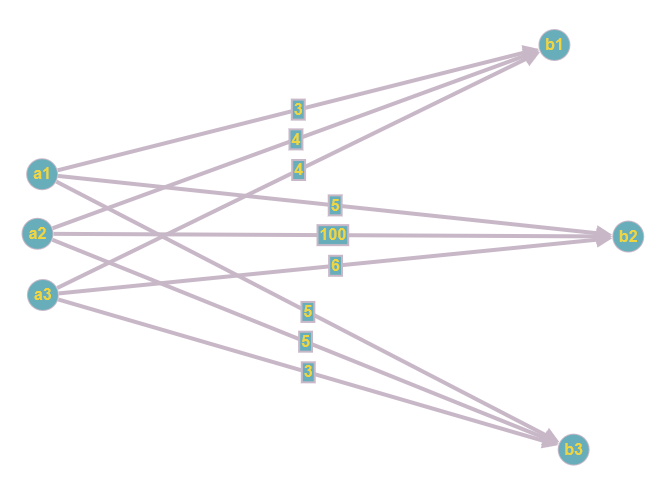

<!-----

Conversion time: 1.845 seconds.

Using this Markdown file:

1. Paste this output into your source file.
2. See the notes and action items below regarding this conversion run.
3. Check the rendered output (headings, lists, code blocks, tables) for proper
   formatting and use a linkchecker before you publish this page.

Conversion notes:

* Docs to Markdown version 1.0$\beta$35
* Mon Dec 18 2023 05:04:11 GMT-0800 (PST)
* Source doc: trabalho_final_respostas
* Tables are currently converted to HTML tables.
----->

Universidade Federal do Pará

Instituto de Ciências Exatas e Naturais

Faculdade de Computação

Análise de Algoritmos

3ª Avaliação

Alunos:

* Luiz Antônio Lima de Freitas Leite - matrícula: 202204940008
* Max…
* Luiz Sérgio Samico Maciel Filho - matrícula: 202204940042
* Wesley Pontes Barbosa - matrícula: 202204940006

# Questão 1.

## Analise as afirmativas abaixo considerando que $\pi_1$ e $\pi_2$ são problemas de decisão e que $\pi_1$ é uma restrição de $\pi_2$. Em seguida, responda se cada uma das afirmativas é verdadeira ou falsa e justifique sua resposta.

### I. Se $\pi_1 \in$ P então $\pi_2 \in$ P.

> RESPOSTA: VERDADEIRO,
por que $\pi_1$ sendo uma restrição de $\pi_2$ ($\pi_2$ $\propto$ $\pi_1$) implica que a instância de $\pi_1$ é um caso específico de $\pi_2$ com algumas condições adicionais. Se já é possível resolver $\pi_1$ em tempo polinomial, então também será possível resolver $\pi_2$ em tempo polinomial, pois $\pi_2$ engloba $\pi_1$ e, portanto, incluirá a solução para $\pi_1$.

### II. Se $\pi_2 \in$ NP e $\pi_1 \in$ NP-Completo, então $\pi_2 \in$ NP-Completo.
> RESPOSTA: VERDADEIRO, pois para $\pi_2$ ser NP-Completo deve satisfazer 2 condições:<br>
> Condição 1: $\pi_2 \in $ NP.<br>
> Condição 2: Todo problema $\beta \in$ NP satisfaz $\beta \propto \pi_2$.
>
>A primeira condição já foi dada, e a segunda condição é satisfeita por transitividade: Sabemos que $\pi_1 \propto \pi_2$, pois $\pi_1$ é restrição de $\pi_2$, então:
>
>$\beta \propto \pi_1$ e $\pi_1 \propto \pi_2  \Rightarrow \beta \propto \pi_2$
>
>Em resumo: “Sejam $\pi_1$ e $\pi_2$ problemas em NP. Se $\pi_1$ for NP-Completo e $\pi_1 \propto \pi_2$, então $\pi_2$ também é NP-Completo.”


### III. $\pi_1$ e $\pi_2$ são polinomialmente equivalentes.

> RESPOSTA: FALSO, <br>
pois apenas está definido que ambos os problemas são de decisão e $\pi_1$ $\propto$ $\pi_2$ , e para serem polinomialmente equivalentes é necessário que $\pi_2$ $\propto$ $\pi_1$ também, o que não pode ser afirmado sem informações adicionais.


### IV. Por serem problemas de decisão, é certo que $\pi_1$ e $\pi_2$ não pertencem à classe NP-Difícil.

> RESPOSTA: FALSO,<br>
pois a classe de problemas NP-Completo, por exemplo, é composta por problemas de decisão NP que ao mesmo tempo são NP-Difícil, portanto, se $\pi_1$ e $\pi_2$ são NP-Completo eles são obrigatoriamente NP-Difícil.

# Questão 2.

## Analise as afirmativas abaixo considerando o problema de decisão da satisfatibilidade de fórmulas (SAT). Em seguida, responda se cada uma das afirmativas é verdadeira ou falsa e justifique sua resposta.

### I. Se SAT está em P, então P $=$ NP.

> RESPOSTA: VERDADEIRO,<br>
pois SAT é NP-Completo e satisfaz a propriedade de que todo problema $\beta \in$ NP satisfaz $\beta \propto$ SAT. Então se SAT for resolvido em tempo polinomial, por transitividade, todos os problemas em NP poderão ser resolvidos em tempo polinomial também após serem transformados em SAT também em tempo polinomial.

### II. Se um problema de decisão $\pi$ está em NP, então SAT é polinomialmente transformável em $\pi$.

>RESPOSTA: FALSO,<br>
pois mesmo que todo problema $\beta \in$ NP satisfaz $\beta \propto$ SAT, o vice-versa não é garantido, portanto é incorreto afirmar SAT $\propto$ $\beta$.

### III. Um problema $\pi$ está em NP-Difícil se e somente se SAT é polinomialmente transformável em $\pi$.

> RESPOSTA: VERDADEIRO,<br>
pois para um problema $\pi$ estar em NP-Difícil ele deve satisfazer a propriedade de que todo problema $\beta \in$ NP satisfaz $\beta \propto \pi$, e como SAT é NP-Completo, e por consequência também é NP, isso implica que SAT $\propto \pi$ deve ser verdadeiro para que $\pi$ satisfaça essa propriedade dos NP-Difíceis.

### IV. Uma importante consequência do Teorema de Cook é que se existe um algoritmo de tempo polinomial para resolver SAT, então existe um algoritmo de tempo polinomial para resolver todos os problemas em NP.

> RESPOSTA: VERDADEIRO,<br>
pois SAT é NP-Completo e satisfaz a propriedade de que todo problema $\beta \in$ NP satisfaz $\beta \propto$ SAT. Então se SAT for resolvido em tempo polinomial, por transitividade, todos os problemas em NP poderão ser resolvidos em tempo polinomial também após serem transformados em SAT também em tempo polinomial.

# Questão 3. 

## Dado que $\pi_1$ e $\pi_2$ são problemas de decisão, indique se cada uma das afirmativas abaixo é verdadeira ou falsa. Em seguida, justifique sua resposta.

### I. Se $\pi_1 \in$ NP-Completo e $\pi_2 \in$ NP, então $\pi_1 \propto \pi_2$

>RESPOSTA: FALSO,<br>
pois mesmo que todo problema $\pi_2 \in$ NP satisfaz $\pi_2 \propto \pi_1$, o vice-versa não é garantido, portanto é incorreto afirmar $\pi_1 \propto \pi_2$.

### II. Não é possível ter uma heurística de custo polinomial para um problema NP-Completo que, para qualquer dado de entrada, garanta obter a solução ótima do problema.

>RESPOSTA: VERDADEIRO,<br>
pois, se fosse encontrado um algoritmo de tempo polinomial que resolva um problema NP-Completo para todas as entradas, isso equivaleria a mostrar que P (problemas solúveis em tempo polinomial) é igual a NP (problemas cujas soluções podem ser verificadas em tempo polinomial), mas até agora essa questão permanece um problema em aberto na teoria da complexidade computacional. Até que essa questão seja resolvida, acredita-se que não existem heurísticas polinomiais que garantam soluções ótimas para todos os casos de problemas NP-Completo.

### III. Considere que $\pi_1 \in$ NP-Completo. Caso fosse descoberto um algoritmo polinomial para resolver $\pi_1$, então todos os problemas em NP também poderiam ser resolvidos em tempo polinomial.

>RESPOSTA: VERDADEIRO,<br>
pois sendo $\pi_1$ NP-Completo ele satisfaz a propriedade de que todo problema $\beta \in$ NP satisfaz $\beta \propto \pi_1$. Então se $\pi_1$ for resolvido em tempo polinomial, por transitividade, todos os problemas em NP poderão ser resolvidos em tempo polinomial também após serem transformados em $\pi_1$ também em tempo polinomial.

### IV. Se P $=$ NP, então todo problema NP-Difícil pode ser resolvido em tempo polinomial.

>RESPOSTA: FALSO,<br>
pois, por exemplo:
>
>É verdade que se $\pi_1$ é restrição de $\pi_2$ , ou seja,  $\pi_2 \propto \pi_1$, e $\pi_1$ é resolvido em tempo polinomial, então $\pi_2$ também é resolvido. Entretanto, o vice-versa não é garantido.
>
>Portanto ainda que para todo problema $\beta \in$ P $=$ NP e $\pi \in$ NP-Difícil, é verdade que $\beta \propto \pi$, resolver $\beta$ não garante a resolução de $\pi$.


### V. Suponha que $\pi_1$ e $\pi_2$ pertencem à classe NP-Completo. Isso implica que existe uma transformação polinomial no tempo de um problema para outro mesmo se P $\neq$ NP.

>RESPOSTA: VERDADEIRO,<br>
pois atualmente não se sabe se P $\neq$ NP, mas já é possível observar que os problemas NP-Completo são polinomialmente equivalentes entre si.

# Questão 4. 

## Uma cobertura de vértices de um grafo $G \neq (V, E)$ é um subconjunto $V^{\prime} \subseteq V$ de $k$ vértices, tal que se $(u, w) \in E$ então $u \in V^{\prime}$ ou $w \in V^{\prime}$ . Isto posto, considere o problema de decisão $\pi$ descrito abaixo para responder os itens a seguir.

### Dados de entrada: Um grafo $G$ e um inteiro $k > 0$.
### Decisão: $G$ possui uma cobertura de vértices de tamanho $\leq k$?
### a) Mostre se o problema $\pi$ pertence, ou não, à classe NP.

>RESPOSTA:  
Para provar que $\pi$ pertence a NP é necessário verificá-lo:<br>
FASE 1: Exibição e justificativa da resposta “sim”.<br>
Dado o grafo $G$ e $k \leq$ 2:<br>

[Grafo G]
>$G(V, E);$ <br>
>$V = {};$
>$E = {}$


>Justificativa para a cobertura de vértices de tamanho menor que x: <br>
$ V^{\prime} = {A} $

[conjunto com menos de x vértices que cubra todo o grafo G]

>
>FASE 2: verificação da resposta “sim” em tempo polinomial:<br>
  pseudocódigo:
```
VERIFICA(G,V',k)
    // primeiro testa o tamanho de V'
    se |V'| > k:
        retorna "FALSO"
    // depois verifica se V' cobre todas as arestas
    teste $\neq$ E // conjunto teste temporário
    para cada v em V':
        para cada e em teste: // "e" é aresta
            se v está em e:
                remove e de teste
    se |teste| $\neq$$\neq$ 0: retorna "VERDADEIRO"
    senão: retorna "FALSO"

complexidade de tempo:
O(|V'| + |V'| * E)
termo mais dominante
O(|V'| * E)
como V não pode ser maior que K:
O(k * E)
```

### b) Sabe-se que o problema da satisfatibilidade de fórmulas (SAT) é polinomialmente transformável no problema $\pi$. Então, é possível afirmar que $\pi \in$ NP-Completo? Por quê?

>RESPOSTA: Sim,<br>
pois para ser NP-Completo deve satisfazer 2 condições:<br>
Condição 1: $ \pi \in $ NP.<br>
Condição 2: Todo problema $\beta \in $ NP satisfaz $\beta$ $\propto$ $\pi$.

    A primeira condição já foi dada, e a segunda condição é satisfeita por transitividade:

    $\beta$ $\propto$ SAT e SAT $\propto$ $\pi$ ⇒ $\beta$ $\propto$ $\pi$

    Em resumo: “Sejam $\pi_1$ e $\pi_2$ problemas em NP. Se $\pi_1$ for NP-Completo e

    $\pi_1$ $\propto$ $\pi_2$ , então $\pi_2$ também é NP-Completo.”

## Questão 5. Considere o problema de decisão $\pi$ descrito abaixo.

### Dados de entrada: Dois grafos $G_1 \neq (V_1, E_1)$ e $G_2 \neq (V_2, E_2)$, com $|V_1| \neq |V_2|$.

### Decisão: Existe uma função f : $V_1$ → $V_2$, tal que (u, w) $\in $E_1$ se e somente se $(f(u), f(w)) \in E_2$, para todo $u, w \in V_1$?

### Mostre se o problema $\pi$ pertence, ou não, à classe NP.

---
    RESPOSTA:
    Para provar que $\pi$ pertence a NP é necessário verificá-lo:

    FASE 1: Exibição e justificativa da resposta “sim”.

    Dado o grafo G1 e G2: \
    [Grafo G1] [Grafo G2]

    justificativa para função que transforma G1 em G2:

    [Conjunto contendo as transformações dos vértices que compõe as arestas]

    FASE 2: verificação da resposta “sim” em tempo polinomial:

    pseudocódigo:
```
VERIFICA(G1, G2, f())
    // primeiro testa as cardinalidades de V1 e V2
    se |V1| !$\neq$ |V2|:
        retorna "FALSO"
    teste1 $\neq$ {} // conjunto de teste temporário
    teste2 $\neq$ E2 // conjunto de teste temporário
    // depois aplica a função f() nos elementos de V1
    para cada (u, w) em E1:
        // adiciona a aresta com os vértices transformados por f()
        teste1 $\neq$ teste1 + (f(u), f(w))
    // em seguida verifica se G1 tornou-se equivalente a G2
    para cada (u1, w1) em teste1:
        para cada (u2, w2) em teste2:
            se (u1, w1) $\neq$$\neq$ (u2, w2):
                remove (u1, w1) de teste1
                remove (u2, w2) de teste2
                pula para o próximo elemento de teste1
    se |teste1 + teste2| $\neq$$\neq$ 0: retorna "VERDADEIRO"
    senão: retorna "FALSO"

complexidade de tempo:
O(|V1| + |E1| + |E1| * |E2|)
termo mais dominante
O(|E1| * |E2|)
```

## Questão 6. Essa questão é composta por 2 (dois) problemas. Observe que todos os algoritmos usados para resolver os problemas devem ser eficientes, ou seja, não é permitido o uso de algoritmos não-polinomiais em nenhuma parte da solução apresentada.

## Problema 1

A Segunda Guerra Mundial iniciou-se no dia 1 de setembro de 1939, quando a Polônia foi subitamente atacada pela Alemanha. O Estado-Maior polonês se reuniu de imediato para decidir sobre as movimentações de tropas que deveriam efetuar, de modo a fazer frente à invasão alemã.

As forças polonesas foram informadas que o ataque alemão se daria em três frentes distintas, com nomes de código $\beta$<sub>1</sub>, $\beta$<sub>2</sub> e $\beta$<sub>3</sub>. Chegou-se à conclusão que seria necessário transportar duas divisões de combate para $\beta$<sub>1</sub>, uma divisão para $\beta$<sub>2</sub> e uma outra para $\beta$<sub>3</sub>. A Polônia dispunha nessa altura de cinco divisões de combate nas cidades mais próximas da fronteira atacada, duas aquarteladas na cidade α<sub>1</sub>, duas em α<sub>2</sub> e uma aquartelada em α<sub>3</sub>. Essas divisões poderiam ser transportadas para os locais em perigo, contudo, a força aérea alemã já sobrevoava a Polônia, e a movimentação das divisões teria que ser feita com o menor risco humano possível.

Após uma rápida inspeção do mapa do território, fez-se o esquema da Figura 1, onde as estradas que poderiam ser utilizadas pelas divisões de combate polonesas são apresentadas. Observe que o valor da aresta representa a distância em quilômetros.

[endereco da foto]
Figura 1: Esquemático do território.

Os generais poloneses precisavam decidir de que aquartelamento deviam seguir as divisões necessárias em $\beta$<sub>1</sub>, $\beta$<sub>2</sub> e $\beta$<sub>3</sub>. O objetivo era a minimização das perdas humanas, relacionado diretamente com o perigo de bombardeamento.

Então, durante a reunião decisiva, o general polonês Edward disse: “O perigo de bombardeamento das divisões em movimento pode ser considerado como diretamente proporcional à distância entre cada cidade α e cada frente $\beta$. Nesse caso, devem-se usar essas distâncias como o perigo que uma divisão corre ao ser transportada de α<sub>i</sub> para $\beta$<sub>i</sub>”. Em seguida, o general Jerzy ordenou: “A divisão que sobrar fica no aquartelamento respectivo”.

### Tarefa: Siga as instruções dos generais Edward e Jerzy, e informe quais foram as decisões tomadas pelas forças armadas polonesas. Explique detalhadamente, por meio de um relatório técnico, a estratégia e os algoritmos usados para resolver o problema.

---
>RESPOSTA:
>Para solucionar a questão, inicialmente definimos o problema da seguinte maneira:
>
> No grafo $G=\{E,V\}$ de $v \in V$ vértices e $e \in E$ arestas com um custo $c(e)$, e sendo $b(v)$ a quantidade de recursos em $v$, temos que $v$ é uma fonte $s \in S$ se $b(v)>0$ e $v$ é um destino $t \in T$ se $b(v) < 0$ e um caminho de um nó s para um nó t é um conjunto de arestas $p \in P$ em que $p = {(s, i_1), (i_1, i_2), (i_2, i_3), \dots , (i_{k−1}, i_k), (i_k, t)}$. O objetivo é definir os caminhos p de menor custo para suprir as demandas de recursos.
>
>A primeira tentativa de solução foi através da utilização do algoritmo de Dijkstra para encontrar o caminho de menor custo entre todos os caminhos de $P$ executando-o a partir de um nó de folga artificial em S até um outro nó de folga artificial em T, e fixamos esse menor caminho suprindo o máximo de demanda da fonte até que ela seja completamente suprida ou a fonte se esgote, depois rodamos o algoritmo de Dijkstra novamente para recalcular os menores caminhos desconsiderando os vértices supridos ou esgotados. 
>
>Esse método direto e intuitivo é uma forma um pouco personalizada de outro que já existia e chama-se método do custo mínimo, de complexidade $O(|E|+|V|\log{|V|})$, o qual, na verdade, não tem garantia de sempre retornar a resposta ótima.
> Como exemplificado no problema abaixo:



> Neste caso, em que S = {a1, a2, a3}, T = {b1, b2, b3}, b(a1) = 2, b(a2) = 2, b(a3) = 1, b(b1) = -2, b(b2) = -1 e b(b3) = -1, ao aplicar o método que fixa primeiro a rota de menor caminho será escolhido a1 para suprir completamente b1 ao custo de 3 duas vezes ao invés de escolher a2 ao custo de 4, a3 suprirá b3 e por fim sobrará apenas a2 para suprir b2 ao custo de 100. Portanto, nós percebemos que era necessário um algoritmo que verificasse mais possibilidades, de forma eficiente, antes de decidir qual s é melhor para suprir cada t considerando o custo total, e não apenas o local.

 Assim, reanalisamos o problema e após pesquisa sobre o assunto, chegamos a conclusão de que se trata, na verdade, de **um problema de fluxo de custo mínimo**, tal seja, dado uma rede em que cada aresta $(i, j)$ possua um fluxo $X_{ij}$ e um custo $c_{ij}$ por unidade de fluxo, o custo total do fluxo na aresta é dado por $c_{ij}X_{ij}$. Um modelo que busca o fluxo de custo mínimo procura uma fluxo viável que tem o menor custo de fluxos:
 $$
 \begin{align} 
\text{Minimizar} &\qquad \Sigma_{(i,j)\in E}C_{ij}X_{ij} \notag\\
\text{s.t} \notag\\
 &\qquad \Sigma_{k:(j,k) \in E}X_{jk} - \Sigma_{i:(i,j)\in E}X_{ij} = b_j, j \in V\\
 &\qquad X_{ij} \geq 0, \qquad (i,j) \in E 
 \end{align}$$

Considerando ainda que queremos abastecer da melhor maneira possível os nós de destino, podemos definir o problema como um problema para encontrar o **fluxo máximo de custo mínimo**.

Dentre os algoritmos pesquisados que solucionam esse tipo de problema, como *Successive Shortest Path*, *Primal-Dual*, e *Network Simplex*, escolhemos o último por conta da performance apresentada.

O algoritmo do *Network Simplex* é a aplicação do método simplex para a modelagem do problema como um programa linear. A estrutura de rede do problema, contudo, faz com que a solução seja significativamente mais simples do que um programa linear genérico.

(Escrever o programa linear no latex e colar aqui).

## Problema 2

Uma indústria deve fabricar um lote composto por 3 (três) peças: duas em PVC (peças A e B) e uma em aço inoxidável (peça C). As peças A e B devem ser torneadas e depois rosqueadas, mas a peça C deve apenas ser torneada. Depois de trabalhadas, as peças A e 

* devem ser montadas e então acopladas à peça B. Finalmente, as peças prontas devem ser embaladas e armazenadas.

    Algumas dessas tarefas podem ser feitas simultaneamente, mas outras dependem de tarefas anteriores. Uma forma de codificar isso é por meio de uma tabela de precedências (vide Tabela 1). Note que ao lado de cada tarefa encontram-se as tarefas das quais ela depende imediatamente e a duração da tarefa em minutos.

Tabela 1: Tabela de Precedências.

<table>
  <tr>
   <td colspan$\neq$"3" >
    Tarefa (ou atividade)
   </td>
   <td>
    Antecedentes
   </td>
   <td>
    Duração (min)
   </td>
  </tr>
  <tr>
   <td>
   </td>
   <td colspan$\neq$"2" >
   </td>
   <td>
   </td>
   <td>
   </td>
  </tr>
  <tr>
   <td>
    1.
   </td>
   <td colspan$\neq$"2" >
    Preparar os tornos
   </td>
   <td>–
   </td>
   <td>8
   </td>
  </tr>
  <tr>
   <td>
   </td>
   <td colspan$\neq$"2" >
   </td>
   <td>
   </td>
   <td>
   </td>
  </tr>
  <tr>
   <td>
    2.
   </td>
   <td colspan$\neq$"2" >
    Preparar as embalagens
   </td>
   <td>–
   </td>
   <td>8
   </td>
  </tr>
  <tr>
   <td>
   </td>
   <td colspan$\neq$"2" >
   </td>
   <td>
   </td>
   <td>
   </td>
  </tr>
  <tr>
   <td>
    3.
   </td>
   <td colspan$\neq$"2" >
    Cortar e distribuir o PVC
   </td>
   <td>–
   </td>
   <td>10
   </td>
  </tr>
  <tr>
   <td>
   </td>
   <td colspan$\neq$"2" >
   </td>
   <td>
   </td>
   <td>
   </td>
  </tr>
  <tr>
   <td>
    4.
   </td>
   <td colspan$\neq$"2" >
    Cortar e distribuir o aço
   </td>
   <td>–
   </td>
   <td>12
   </td>
  </tr>
  <tr>
   <td>
   </td>
   <td colspan$\neq$"2" >
   </td>
   <td>
   </td>
   <td>
   </td>
  </tr>
  <tr>
   <td>
    5.
   </td>
   <td colspan$\neq$"2" >
    Tornear a peça A
   </td>
   <td>1,3
   </td>
   <td>8
   </td>
  </tr>
  <tr>
   <td>
   </td>
   <td colspan$\neq$"2" >
   </td>
   <td>
   </td>
   <td>
   </td>
  </tr>
  <tr>
   <td>
    6.
   </td>
   <td colspan$\neq$"2" >
    Tornear a peça B
   </td>
   <td>1,3
   </td>
   <td>11
   </td>
  </tr>
  <tr>
   <td>
   </td>
   <td colspan$\neq$"2" >
   </td>
   <td>
   </td>
   <td>
   </td>
  </tr>
  <tr>
   <td>
    7.
   </td>
   <td colspan$\neq$"2" >
    Tornear a peça C
   </td>
   <td>1,4
   </td>
   <td>15
   </td>
  </tr>
  <tr>
   <td>
   </td>
   <td colspan$\neq$"2" >
   </td>
   <td>
   </td>
   <td>
   </td>
  </tr>
  <tr>
   <td>
    8.
   </td>
   <td colspan$\neq$"2" >
    Rosquear a peça A
   </td>
   <td>5
   </td>
   <td>9
   </td>
  </tr>
  <tr>
   <td>
   </td>
   <td colspan$\neq$"2" >
   </td>
   <td>
   </td>
   <td>
   </td>
  </tr>
  <tr>
   <td>
    9.
   </td>
   <td colspan$\neq$"2" >
    Rosquear a peça B
   </td>
   <td>6
   </td>
   <td>7
   </td>
  </tr>
  <tr>
   <td colspan$\neq$"2" >
   </td>
   <td>
   </td>
   <td>
   </td>
   <td>
   </td>
  </tr>
  <tr>
   <td colspan$\neq$"2" >
    10.
   </td>
   <td>
    Montar as peças A e C
   </td>
   <td>7,8
   </td>
   <td>4
   </td>
  </tr>
  <tr>
   <td colspan$\neq$"2" >
   </td>
   <td>
   </td>
   <td>
   </td>
   <td>
   </td>
  </tr>
  <tr>
   <td colspan$\neq$"2" >
    11.
   </td>
   <td>
    Montar a peça B
   </td>
   <td>9,10
   </td>
   <td>6
   </td>
  </tr>
  <tr>
   <td colspan$\neq$"2" >
   </td>
   <td>
   </td>
   <td>
   </td>
   <td>
   </td>
  </tr>
  <tr>
   <td colspan$\neq$"2" >
    12.
   </td>
   <td>
    Embalar e armazenar
   </td>
   <td>2,11
   </td>
   <td>7
   </td>
  </tr>
  <tr>
   <td>
   </td>
   <td>
   </td>
   <td>
   </td>
   <td>
   </td>
   <td>
   </td>
  </tr>
</table>

        Tarefa: Explique, por meio de um relatório técnico, a estratégia e os algoritmos usados para encontrar:

* O tempo mínimo, isto é, o tempo antes do qual não é possível terminar o conjunto de tarefas;
* As tarefas críticas ou de folga nula, ou seja, aquelas que não toleram atrasos;
* As tarefas que podem sofrer atrasos com as respectivas folgas.

